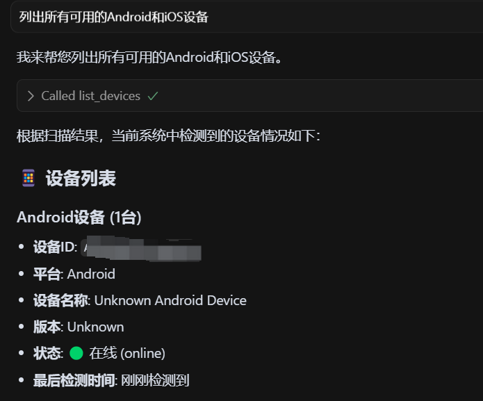
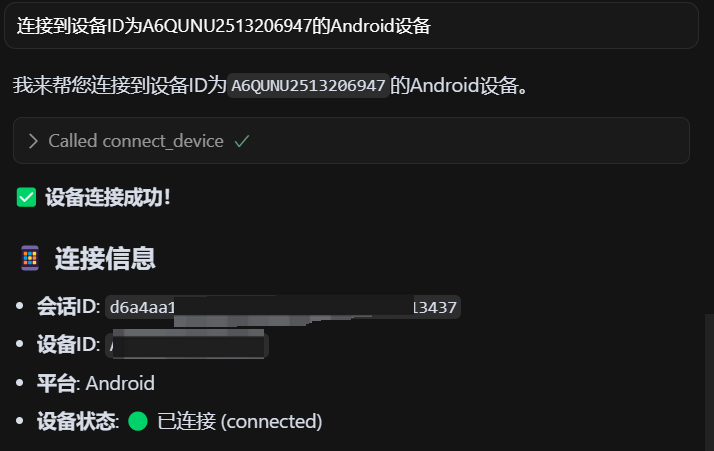
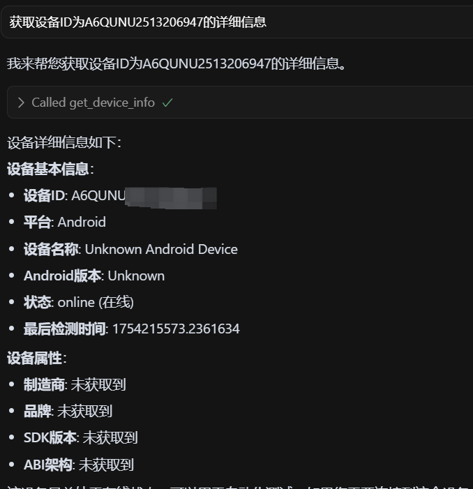
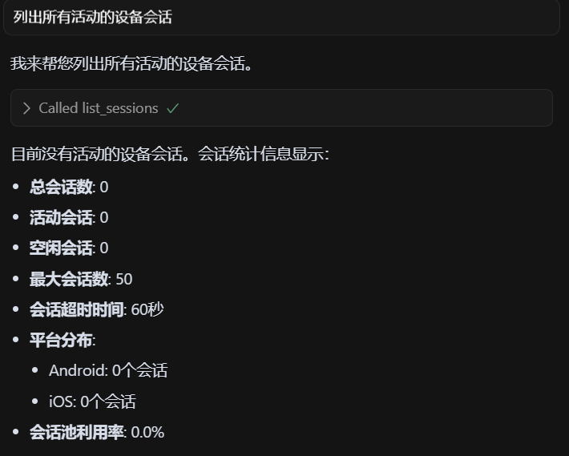
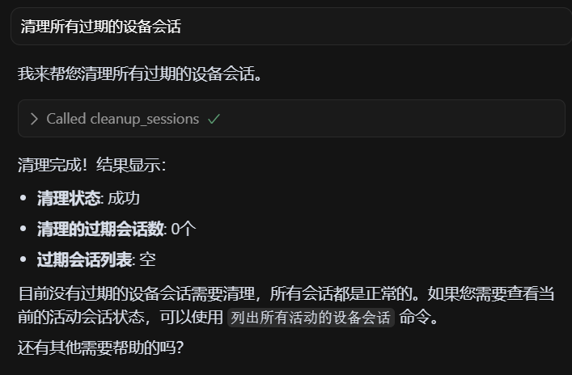
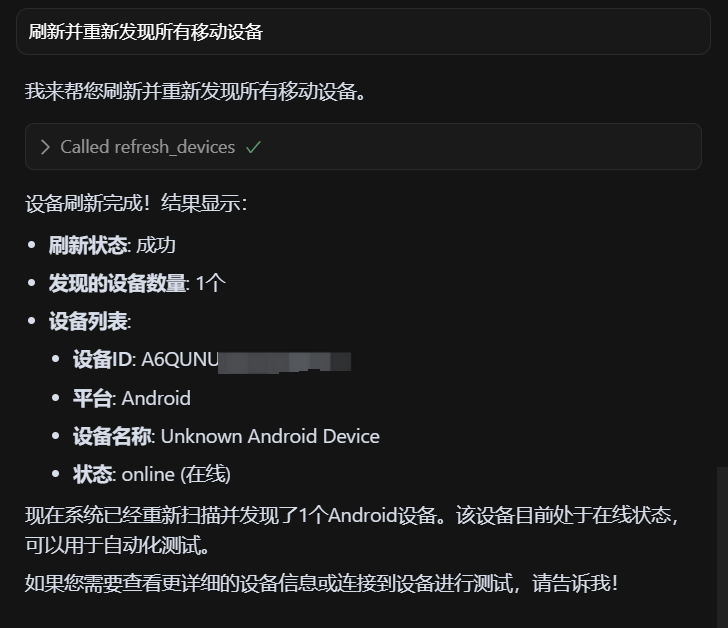
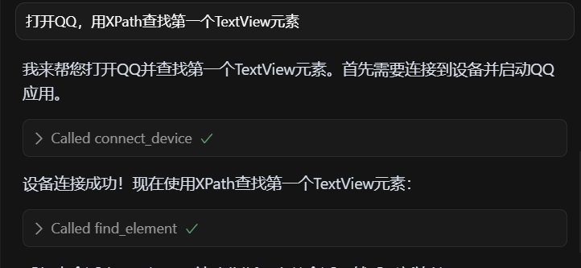

# Appium MCP 工具使用指南

本文档详细介绍了 Appium MCP 项目中所有可用的工具，包括功能说明、AI调用提示词和使用示例。

## 工具概览

Appium MCP 提供了 13 个核心工具，分为两大类：
- **设备管理工具**：用于管理移动设备连接和会话
- **UI自动化工具**：用于执行移动应用的UI操作

---

## 设备管理工具

### 1. mcp_appium_list_devices
**功能**：列出所有可用的移动设备（Android和iOS）

**AI调用提示词**：
```
列出所有可用的Android和iOS设备
```

**工具参数说明**：
- `platform` (可选): 过滤特定平台的设备 ("android" 或 "ios")
- `status` (可选): 过滤特定状态的设备 ("online", "offline", "connected")

**截图占位符**：


---

### 2. mcp_appium_connect_device
**功能**：连接到指定的移动设备并创建会话

**AI调用提示词**：
```
连接到设备ID为A6QUNU2513206947的Android设备
```

**工具参数说明**：
- `device_id` (必需): 设备ID（从list_devices获取）
- `app_package` (可选): 要启动的Android应用包名
- `app_activity` (可选): 要启动的Android应用Activity
- `bundle_id` (可选): 要启动的iOS应用Bundle ID
- `no_reset` (可选): 是否在会话开始时重置应用状态
- `full_reset` (可选): 是否完全重置应用（卸载重装）

**截图占位符**：


---

### 3. mcp_appium_disconnect_device
**功能**：断开指定设备的连接并关闭会话

**AI调用提示词**：
```
断开会话ID为d6a4aa14-ba2c-4e42-b20f-470c6a813437的设备连接
```

**工具参数说明**：
- `session_id` (必需): 会话ID（从connect_device获取）

**截图占位符**：


---

### 4. mcp_appium_get_device_info
**功能**：获取指定设备的详细信息

**AI调用提示词**：
```
获取设备ID为A6QUNU2513206947的详细信息
```

**工具参数说明**：
- `device_id` (必需): 设备ID

**截图占位符**：


---

### 5. mcp_appium_get_session_info
**功能**：获取指定会话的详细信息

**AI调用提示词**：
```
获取会话ID为d6a4aa14-ba2c-4e42-b20f-470c6a813437的详细信息
```

**工具参数说明**：
- `session_id` (必需): 会话ID

**截图占位符**：


---

### 6. mcp_appium_list_sessions
**功能**：列出所有活动的设备会话

**AI调用提示词**：
```
列出所有活动的设备会话
```

**工具参数说明**：
- `random_string` (必需): 占位参数，可以传入任意字符串

**截图占位符**：


---

### 7. mcp_appium_cleanup_sessions
**功能**：手动清理过期的设备会话

**AI调用提示词**：
```
清理所有过期的设备会话
```

**工具参数说明**：
- `random_string` (必需): 占位参数，可以传入任意字符串

**截图占位符**：


---

### 8. mcp_appium_refresh_devices
**功能**：手动刷新和重新发现移动设备

**AI调用提示词**：
```
刷新并重新发现所有移动设备
```

**工具参数说明**：
- `random_string` (必需): 占位参数，可以传入任意字符串

**截图占位符**：


---

## UI自动化工具

### 9. mcp_appium_find_element
**功能**：查找单个UI元素

**AI调用提示词**：
```
在会话中使用XPath查找第一个TextView元素
```

**工具参数说明**：
- `session_id` (必需): 会话ID
- `locator_type` (必需): 元素定位器类型 ("id", "name", "class_name", "tag_name", "xpath", "css_selector", "accessibility_id", "android_uiautomator", "ios_predicate", "ios_class_chain")
- `locator_value` (必需): 元素定位器值
- `timeout` (可选): 查找超时时间（秒），默认10秒

**截图占位符**：


---

### 10. mcp_appium_click_element
**功能**：点击指定的UI元素

**AI调用提示词**：
```
点击ID为com.example.app:id/button的按钮元素
```

**工具参数说明**：
- `session_id` (必需): 会话ID
- `locator_type` (必需): 元素定位器类型
- `locator_value` (必需): 元素定位器值
- `timeout` (可选): 查找元素超时时间（秒）

**截图占位符**：


---

### 11. mcp_appium_input_text
**功能**：在指定的UI元素中输入文本

**AI调用提示词**：
```
在ID为username的输入框中输入文本"testuser"
```

**工具参数说明**：
- `session_id` (必需): 会话ID
- `text` (必需): 要输入的文本
- `locator_type` (必需): 元素定位器类型
- `locator_value` (必需): 元素定位器值
- `clear_first` (可选): 是否先清空现有文本
- `timeout` (可选): 查找元素超时时间（秒）

**截图占位符**：


---

### 12. mcp_appium_take_screenshot
**功能**：截取当前屏幕的截图

**AI调用提示词**：
```
截取当前屏幕的截图并保存为test_screenshot.png
```

**工具参数说明**：
- `session_id` (必需): 会话ID
- `filename` (可选): 截图文件名
- `format` (可选): 截图格式 ("png" 或 "jpg")

**截图占位符**：


---

### 13. mcp_appium_swipe
**功能**：在屏幕上执行滑动手势

**AI调用提示词**：
```
在屏幕上从坐标(500,800)滑动到(500,400)执行向上滑动
```

**工具参数说明**：
- `session_id` (必需): 会话ID
- `start_x` (必需): 起始X坐标
- `start_y` (必需): 起始Y坐标
- `end_x` (必需): 结束X坐标
- `end_y` (必需): 结束Y坐标
- `duration` (可选): 滑动持续时间（毫秒），默认1000

**截图占位符**：


---

## 使用流程建议

### 基本设备连接流程
1. 使用 `mcp_appium_list_devices` 列出可用设备
2. 使用 `mcp_appium_connect_device` 连接到目标设备
3. 使用 `mcp_appium_get_session_info` 验证连接状态
4. 执行UI自动化操作
5. 使用 `mcp_appium_disconnect_device` 断开连接

### UI自动化操作流程
1. 使用 `mcp_appium_take_screenshot` 查看当前界面
2. 使用 `mcp_appium_find_element` 定位目标元素
3. 使用 `mcp_appium_click_element` 或 `mcp_appium_input_text` 执行操作
4. 使用 `mcp_appium_swipe` 执行滑动操作（如需要）
5. 重复以上步骤完成自动化流程

---

## 注意事项

1. **会话管理**：每个设备连接都会创建一个唯一的会话ID，所有UI操作都需要使用这个会话ID
2. **超时设置**：查找元素时建议设置合适的超时时间，避免等待过长
3. **错误处理**：工具会返回详细的错误信息，帮助诊断问题
4. **设备状态**：在执行UI操作前，确保设备处于连接状态
5. **资源清理**：测试完成后记得断开设备连接，释放资源

---

## 更新日志

- **v1.0.0** - 初始版本，包含13个核心工具
- 支持Android和iOS设备管理
- 支持基本的UI自动化操作
- 提供完整的错误处理和状态管理