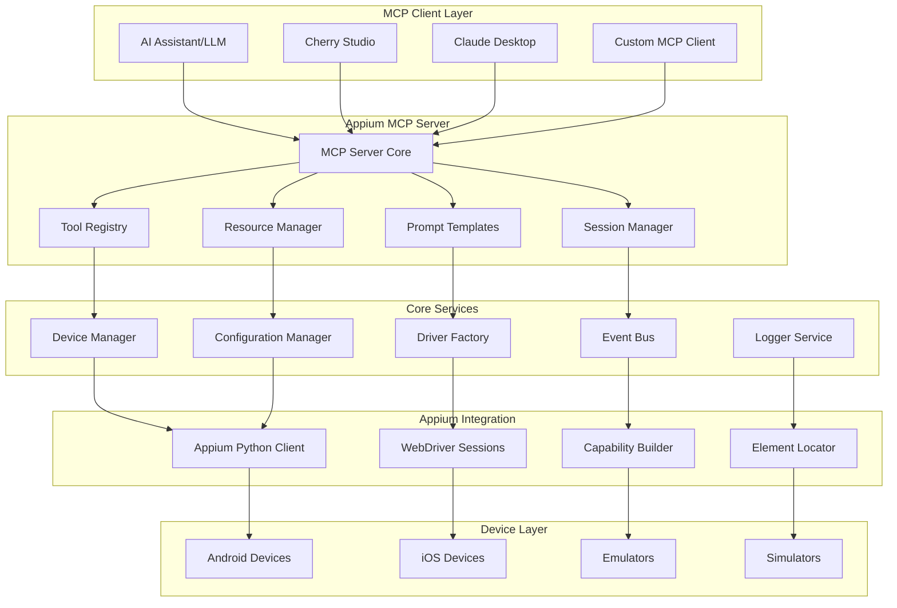
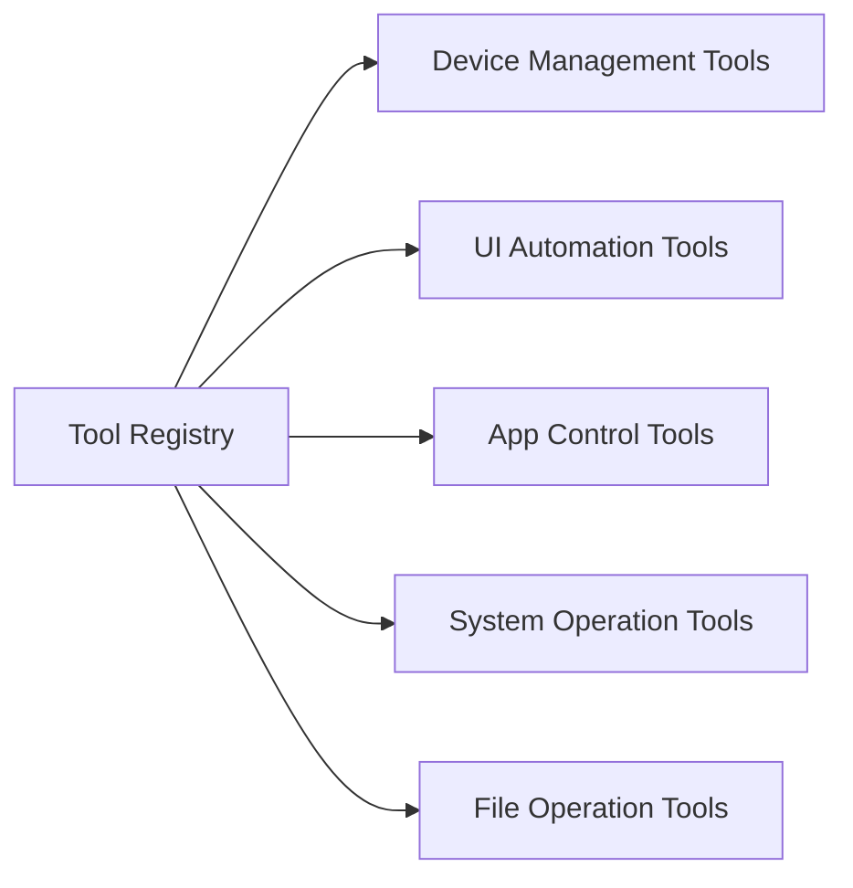
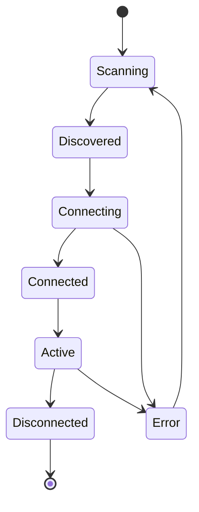
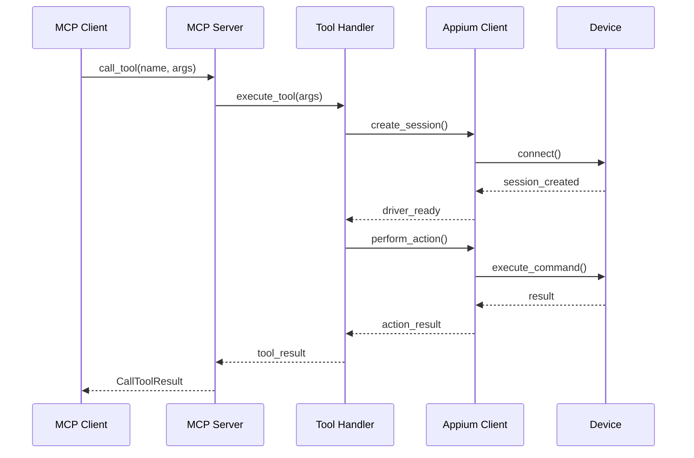
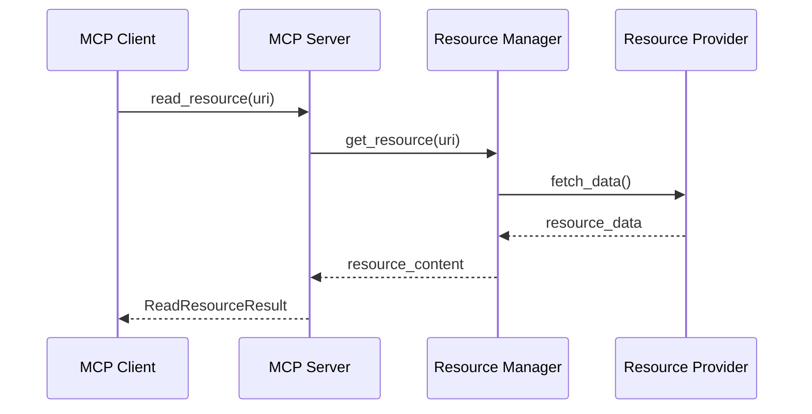

# 架构设计

本文档详细介绍Appium MCP服务器的系统架构、设计原理和核心组件。

## 🏗️ 整体架构



## 🧩 核心组件

### 1. MCP Server Core

**职责**: MCP协议实现和客户端通信管理

```python
# 核心能力声明
SERVER_CAPABILITIES = {
    "tools": {
        "listChanged": True  # 支持工具列表变更通知
    },
    "resources": {
        "subscribe": True,   # 支持资源订阅
        "listChanged": True  # 支持资源列表变更通知
    },
    "prompts": {
        "listChanged": True  # 支持提示模板变更通知
    },
    "logging": {}           # 支持日志记录
}
```

**关键特性**:
- 遵循MCP 1.0协议规范
- 支持stdio和HTTP传输
- 异步消息处理
- 自动错误恢复

### 2. Tool Registry (工具注册表)

**职责**: 工具的注册、发现和调用管理



**工具分类**:

| 分类 | 数量 | 主要功能 |
|------|------|----------|
| 设备管理 | 8个 | 设备连接、信息获取、应用管理 |
| UI自动化 | 12个 | 元素查找、交互操作、手势控制 |
| 应用控制 | 6个 | 应用启动、状态管理、生命周期 |
| 系统操作 | 10个 | 截图、录屏、按键、旋转 |
| 文件操作 | 4个 | 文件传输、目录管理 |

### 3. Resource Manager (资源管理器)

**职责**: 动态资源的管理和访问控制

```mermaid
graph TD
    A[Resource Manager] --> B[Device Resources]
    A --> C[Session Resources]
    A --> D[Configuration Resources]
    A --> E[Log Resources]
    
    B --> F[device://connected]
    B --> G[device://capabilities/{id}]
    
    C --> H[session://active]
    C --> I[session://history]
    
    D --> J[config://profiles]
    D --> K[config://current]
    
    E --> L[logs://appium]
    E --> M[logs://server]
```

### 4. Session Manager (会话管理器)

**职责**: 设备会话的生命周期管理

```python
class SessionState:
    IDLE = "idle"           # 空闲状态
    CONNECTING = "connecting"  # 连接中
    ACTIVE = "active"       # 活跃状态
    SUSPENDED = "suspended" # 挂起状态
    ERROR = "error"         # 错误状态
    CLOSED = "closed"       # 已关闭
```

**特性**:
- 多设备并发支持
- 会话状态持久化
- 自动故障恢复
- 资源清理管理

### 5. Device Manager (设备管理器)

**职责**: 设备发现、连接和状态监控



**功能模块**:
- **设备发现**: ADB设备扫描、iOS设备检测
- **连接管理**: 设备连接池、连接重试机制
- **状态监控**: 实时设备状态、健康检查
- **能力检测**: 设备能力识别、兼容性检查

## 🔄 数据流设计

### 1. 工具调用流程



### 2. 资源访问流程



## 🎯 设计原则

### 1. 可扩展性 (Extensibility)

- **插件化架构**: 工具和资源支持动态加载
- **接口标准化**: 统一的扩展接口定义
- **配置驱动**: 通过配置文件控制功能启用

### 2. 可靠性 (Reliability)

- **故障隔离**: 单个设备故障不影响其他设备
- **自动恢复**: 连接断开时自动重连机制
- **状态持久化**: 关键状态数据持久化存储

### 3. 性能优化 (Performance)

- **连接池管理**: 复用设备连接减少开销
- **异步处理**: 全异步架构避免阻塞
- **缓存策略**: 智能缓存减少重复操作

### 4. 安全性 (Security)

- **权限控制**: 基于角色的访问控制
- **数据加密**: 敏感数据传输加密
- **审计日志**: 完整的操作审计记录

## 🔧 技术选型

### 1. 核心依赖

| 组件 | 版本 | 用途 |
|------|------|------|
| mcp | >=1.12.0 | MCP协议实现 |
| Appium-Python-Client | >=4.0.0 | Appium客户端 |
| pydantic | >=2.0.0 | 数据验证和序列化 |
| asyncio | 内置 | 异步编程支持 |

### 2. 可选依赖

| 组件 | 版本 | 用途 |
|------|------|------|
| pillow | >=10.0.0 | 图像处理 |
| aiofiles | >=23.0.0 | 异步文件操作 |
| structlog | >=23.0.0 | 结构化日志 |
| prometheus-client | >=0.19.0 | 监控指标 |

## 📊 性能指标

### 1. 响应时间目标

| 操作类型 | 目标时间 | 最大时间 |
|----------|----------|----------|
| 设备连接 | <2s | <5s |
| 元素查找 | <500ms | <2s |
| 点击操作 | <200ms | <1s |
| 截图操作 | <1s | <3s |
| 文件传输 | <100MB/s | - |

### 2. 并发支持

- **最大设备连接数**: 50个
- **并发工具调用**: 100个/秒
- **内存使用**: <1GB (50设备)
- **CPU使用**: <80% (正常负载)

## 🔍 监控和观测

### 1. 关键指标

```python
# 业务指标
device_connection_count = Gauge('appium_mcp_device_connections', '当前设备连接数')
tool_call_duration = Histogram('appium_mcp_tool_call_duration_seconds', '工具调用耗时')
error_rate = Counter('appium_mcp_errors_total', '错误计数', ['error_type'])

# 系统指标
memory_usage = Gauge('appium_mcp_memory_bytes', '内存使用量')
cpu_usage = Gauge('appium_mcp_cpu_percent', 'CPU使用率')
```

### 2. 日志结构

```python
# 结构化日志示例
logger.info(
    "device_connected",
    device_id="emulator-5554",
    platform="Android",
    version="11.0",
    duration_ms=1250
)
```

## 🔄 扩展机制

### 1. 工具扩展

```python
# 自定义工具示例
@tool("custom_gesture")
async def custom_gesture(
    device_id: str,
    gesture_data: dict
) -> dict:
    """执行自定义手势操作"""
    # 实现逻辑
    pass
```

### 2. 资源扩展

```python
# 自定义资源提供者
class CustomResourceProvider:
    async def get_resource(self, uri: str) -> ResourceContent:
        """获取自定义资源"""
        # 实现逻辑
        pass
```

---

> 💡 **设计哲学**: 简单易用、稳定可靠、高性能、易扩展。每个设计决策都围绕这四个核心原则展开。 