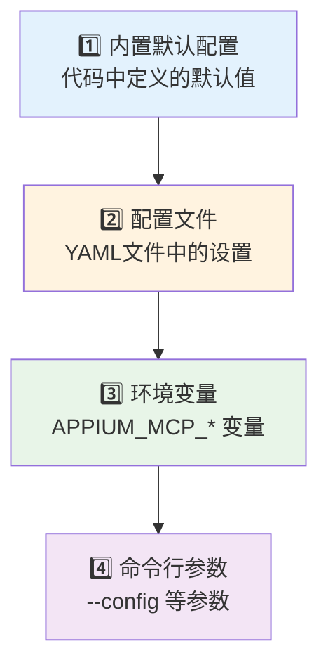

# 配置指南

本文档详细介绍Appium MCP服务器的配置选项，帮助您根据需求定制服务器行为。

## ⚙️ 配置加载机制

### 配置加载优先级

Appium MCP服务器采用分层配置系统，按以下优先级加载配置（后者覆盖前者）：



### 自动配置发现

**重要**：即使不指定 `--config` 参数，服务器也会自动查找并加载默认位置的配置文件！

```python
# 配置文件自动发现逻辑
if 配置文件存在于默认位置:
    自动加载并应用配置文件
else:
    使用内置默认配置
```

### 配置加载示例

```bash
# 情况1：使用内置默认配置（无配置文件）
appium-mcp-server run
# ✅ 使用代码中定义的默认值

# 情况2：自动加载默认位置的配置文件
appium-mcp-server run
# ✅ 如果 %APPDATA%\appium-mcp\config.yaml 存在，会自动加载

# 情况3：指定配置文件路径
appium-mcp-server --config /path/to/custom.yaml run
# ✅ 使用指定的配置文件

# 情况4：环境变量覆盖
set APPIUM_MCP_SERVER_PORT=5000
appium-mcp-server run
# ✅ 端口设置会被环境变量覆盖为5000
```

## 📁 配置文件位置

### 默认配置文件路径

| 操作系统 | 配置文件路径 |
|----------|--------------|
| Linux | `~/.config/appium-mcp/config.yaml` |
| macOS | `~/.config/appium-mcp/config.yaml` |
| Windows | `%APPDATA%\appium-mcp\config.yaml` |

### 生成配置文件

```bash
# 生成默认配置文件到默认位置
appium-mcp-server init-config

# 指定配置文件路径生成
appium-mcp-server --config /path/to/config.yaml init-config

# 查看当前配置
appium-mcp-server show-config

# 验证配置文件
appium-mcp-server validate-config
```

### ⚠️ 已知问题

**配置文件生成Bug**：当前版本的 `init-config` 命令存在Bug，生成的配置文件可能不完整。建议：

1. **推荐方案**：直接使用内置默认配置，无需生成配置文件
2. **临时方案**：如需自定义配置，手动创建配置文件或使用环境变量

## 🔧 配置文件结构

### 完整配置示例

```yaml
# Appium MCP服务器配置文件
# 版本: 1.0.0

# 服务器基础配置
server:
  # Appium服务器地址
  host: "localhost"
  port: 4723
  
  # 连接超时设置 (秒)
  timeout: 30
  new_command_timeout: 60
  
  # 传输协议配置
  transport:
    type: "stdio"  # stdio | http
    http_port: 8080  # HTTP模式下的端口
  
  # 性能配置
  max_connections: 50
  connection_pool_size: 10
  
  # 安全配置
  allow_cors: true
  allowed_origins: ["*"]

# 设备配置
devices:
  # Android设备默认配置
  android:
    platform_name: "Android"
    automation_name: "UiAutomator2"
    device_name: "Android Device"
    
    # 超时设置
    implicit_wait: 10
    explicit_wait: 30
    
    # 性能配置
    skip_server_installation: false
    skip_device_initialization: false
    no_reset: false
    full_reset: false
    
    # Chrome驱动配置
    chrome_driver_executable: null
    chrome_options:
      - "--no-sandbox"
      - "--disable-dev-shm-usage"
  
  # iOS设备默认配置  
  ios:
    platform_name: "iOS"
    automation_name: "XCUITest"
    device_name: "iPhone Simulator"
    
    # 超时设置
    implicit_wait: 10
    explicit_wait: 30
    
    # iOS特定配置
    use_new_wda: true
    wda_local_port: 8100
    wda_startup_retries: 2
    wda_startup_retry_interval: 20000
    
    # Xcode配置
    xcode_org_id: null
    xcode_signing_id: null
    updatedWDABundleId: null

# 日志配置
logging:
  # 日志级别: DEBUG | INFO | WARNING | ERROR
  level: "INFO"
  
  # 日志输出
  console: true
  file: "appium-mcp.log"
  
  # 日志格式
  format: "%(asctime)s - %(name)s - %(levelname)s - %(message)s"
  
  # 日志轮转
  max_file_size: "10MB"
  backup_count: 5
  
  # 结构化日志
  structured: true
  json_format: false

# 功能特性配置
features:
  # 自动截图
  auto_screenshot: true
  screenshot_on_error: true
  screenshot_format: "png"  # png | jpg
  
  # 元素高亮
  element_highlight: true
  highlight_color: "#FF0000"
  highlight_duration: 1000
  
  # 性能监控
  performance_logging: true
  performance_metrics:
    - "cpu"
    - "memory" 
    - "network"
    - "battery"
  
  # 录屏配置
  screen_recording: true
  recording_format: "mp4"
  recording_quality: "medium"  # low | medium | high
  
  # 设备管理
  auto_detect_devices: true
  device_health_check: true
  health_check_interval: 30  # 秒

# 工具配置
tools:
  # 启用/禁用特定工具
  enabled:
    - "device_management"
    - "ui_automation" 
    - "app_control"
    - "system_operations"
    - "file_operations"
  
  # 工具超时配置
  timeouts:
    find_element: 10
    click_element: 5
    input_text: 10
    screenshot: 15
    file_transfer: 60
  
  # 重试配置
  retries:
    max_attempts: 3
    retry_delay: 1  # 秒
    exponential_backoff: true

# 资源配置
resources:
  # 缓存配置
  cache:
    enabled: true
    ttl: 300  # 秒
    max_size: 100  # MB
  
  # 文件存储
  storage:
    screenshots_dir: "./screenshots"
    recordings_dir: "./recordings"
    logs_dir: "./logs"
    temp_dir: "./temp"
    
    # 清理策略
    auto_cleanup: true
    cleanup_interval: 3600  # 秒
    max_age: 86400  # 秒

# 监控配置
monitoring:
  # 指标收集
  metrics:
    enabled: true
    port: 9090
    endpoint: "/metrics"
  
  # 健康检查
  health_check:
    enabled: true
    endpoint: "/health"
    interval: 30  # 秒
  
  # 告警配置
  alerts:
    enabled: false
    webhook_url: null
    thresholds:
      error_rate: 0.05
      response_time: 5000  # 毫秒
      memory_usage: 0.8

# 安全配置
security:
  # 认证配置
  authentication:
    enabled: false
    type: "token"  # token | oauth
    token: null
    
  # 授权配置
  authorization:
    enabled: false
    roles:
      admin: ["*"]
      user: ["read", "execute"]
  
  # 审计日志
  audit:
    enabled: true
    log_file: "audit.log"
    include_payloads: false

# 扩展配置
extensions:
  # 自定义工具路径
  custom_tools_path: "./custom_tools"
  
  # 插件配置
  plugins:
    enabled: []
    
  # 钩子函数
  hooks:
    before_tool_call: null
    after_tool_call: null
    on_error: null

# 开发配置
development:
  # 调试模式
  debug: false
  
  # 热重载
  hot_reload: false
  
  # 开发工具
  dev_tools: false
  
  # 测试模式
  test_mode: false
```

## 🎛️ 配置详解

### 1. 服务器配置 (server)

```yaml
server:
  host: "localhost"          # Appium服务器主机地址
  port: 4723                 # Appium服务器端口
  timeout: 30                # 连接超时时间
  new_command_timeout: 60    # 新命令超时时间
  max_connections: 50        # 最大连接数
```

**重要参数说明**:
- `timeout`: 建立连接的超时时间
- `new_command_timeout`: 两个命令之间的最大间隔时间
- `max_connections`: 同时支持的最大设备连接数

### 2. 设备配置 (devices)

#### Android配置

```yaml
devices:
  android:
    automation_name: "UiAutomator2"    # 自动化引擎
    implicit_wait: 10                  # 隐式等待时间
    no_reset: false                    # 是否重置应用状态
    full_reset: false                  # 是否完全重置
```

#### iOS配置

```yaml
devices:
  ios:
    automation_name: "XCUITest"        # 自动化引擎
    use_new_wda: true                  # 使用新版WebDriverAgent
    wda_local_port: 8100               # WDA本地端口
```

### 3. 日志配置 (logging)

```yaml
logging:
  level: "INFO"                       # 日志级别
  console: true                       # 控制台输出
  file: "appium-mcp.log"             # 日志文件
  structured: true                    # 结构化日志
```

**日志级别说明**:
- `DEBUG`: 详细调试信息
- `INFO`: 一般信息
- `WARNING`: 警告信息  
- `ERROR`: 错误信息

### 4. 功能特性配置 (features)

```yaml
features:
  auto_screenshot: true               # 自动截图
  element_highlight: true             # 元素高亮
  performance_logging: true           # 性能监控
  auto_detect_devices: true           # 自动检测设备
```

## 🔄 配置管理

### 环境变量覆盖

支持使用环境变量覆盖配置文件设置：

```bash
# 设置Appium服务器地址
export APPIUM_MCP_SERVER_HOST="192.168.1.100"
export APPIUM_MCP_SERVER_PORT="4724"

# 设置日志级别
export APPIUM_MCP_LOG_LEVEL="DEBUG"

# 启动服务器
appium-mcp-server
```

### 命令行参数

```bash
# 指定配置文件
appium-mcp-server --config /path/to/config.yaml

# 覆盖特定配置
appium-mcp-server --host 0.0.0.0 --port 4724 --log-level DEBUG

# 启用调试模式
appium-mcp-server --debug
```

### 配置验证

```bash
# 验证配置文件语法
appium-mcp-server validate-config

# 显示合并后的配置
appium-mcp-server show-config --merged

# 测试配置
appium-mcp-server test-config
```

## 📊 配置模板

### 开发环境配置

```yaml
# 开发环境配置模板
server:
  host: "localhost"
  port: 4723
  timeout: 60

logging:
  level: "DEBUG"
  console: true
  file: "dev-appium-mcp.log"

features:
  auto_screenshot: true
  element_highlight: true
  performance_logging: false

development:
  debug: true
  hot_reload: true
```

### 生产环境配置

```yaml
# 生产环境配置模板
server:
  host: "0.0.0.0"
  port: 4723
  timeout: 30
  max_connections: 100

logging:
  level: "INFO"
  console: false
  file: "prod-appium-mcp.log"
  structured: true

features:
  auto_screenshot: false
  performance_logging: true

monitoring:
  metrics:
    enabled: true
  health_check:
    enabled: true

security:
  authentication:
    enabled: true
```

### 测试环境配置

```yaml
# 测试环境配置模板
server:
  host: "localhost"
  port: 4723
  timeout: 45

devices:
  android:
    no_reset: true
    full_reset: false
  ios:
    use_new_wda: true

features:
  auto_screenshot: true
  screenshot_on_error: true

development:
  test_mode: true
```

## 🔍 配置优化建议

### 性能优化

```yaml
# 高性能配置
server:
  max_connections: 100
  connection_pool_size: 20

devices:
  android:
    skip_server_installation: true
    skip_device_initialization: true
  
features:
  auto_screenshot: false  # 禁用自动截图提升性能
  performance_logging: true

resources:
  cache:
    enabled: true
    max_size: 500  # 增大缓存
```

### 稳定性优化

```yaml
# 高稳定性配置
server:
  timeout: 60
  new_command_timeout: 120

tools:
  retries:
    max_attempts: 5
    exponential_backoff: true

features:
  device_health_check: true
  health_check_interval: 15

monitoring:
  alerts:
    enabled: true
```

### 安全性配置

```yaml
# 高安全性配置
server:
  allow_cors: false
  allowed_origins: ["https://your-domain.com"]

security:
  authentication:
    enabled: true
    type: "token"
  authorization:
    enabled: true
  audit:
    enabled: true
    include_payloads: true
```

## 🚨 配置注意事项

### 1. 端口冲突

确保配置的端口未被其他服务占用：

```bash
# 检查端口占用
netstat -an | grep 4723
lsof -i :4723
```

### 2. 权限问题

确保服务器有足够权限访问：
- 设备连接
- 文件系统
- 网络端口

### 3. 资源限制

注意系统资源限制：
- 最大文件描述符数
- 内存使用限制
- 磁盘空间

### 4. 配置同步

多环境部署时注意配置同步：
- 使用版本控制管理配置
- 敏感信息使用环境变量
- 定期备份配置文件

---

> 💡 **最佳实践**: 建议为不同环境创建不同的配置文件，并使用配置管理工具进行统一管理。定期检查和更新配置以确保最佳性能和安全性。 